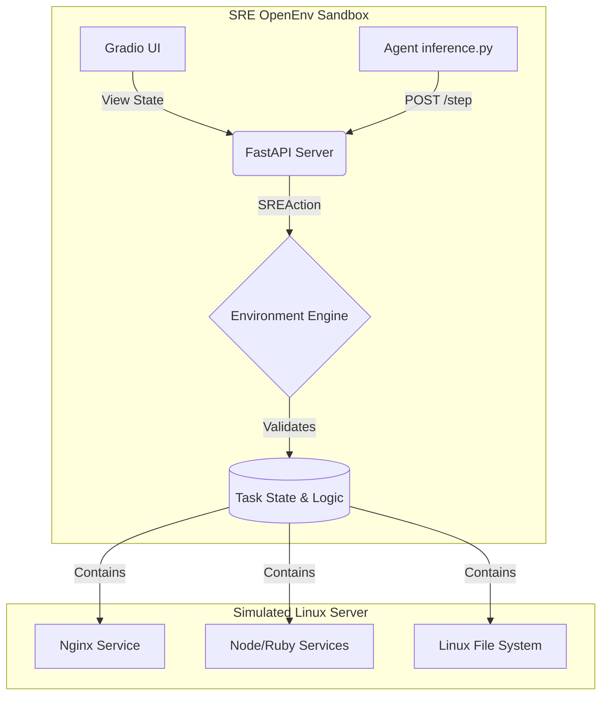

# 🔧 SRE OpenEnv: Automated Incident Response Arena


**Developed for the Meta PyTorch Hackathon x Scaler School of Technology.**

SRE OpenEnv is a highly extensible, simulated containerized sandbox engineered to benchmark, evaluate, and train LLM-driven agents on complex Site Reliability Engineering (SRE) and DevOps incidents.

---

## 🎥 1-Minute Demo Video

*(Judges: Please click the thumbnail or link below to view the Live Demo recorded via Loom!)*

[**▶ Watch the Live Walkthrough & Demo Here**](#) *(Add Loom link here)*

---

## 🧠 Why SRE OpenEnv?

Most LLM benchmarks rely on static QA logic or multiple-choice questions. SRE OpenEnv takes LLM evaluation into the real world. 
We provide agents with an **Interactive, Multi-mode Sandbox**. If a microservice crashes due to bad configuration or port binding conflicts, the agent must figure out the problem using classic Linux primitives, rewrite the configuration file, and restart the service via `systemctl`. We grade their accuracy and the efficiency of their steps.

### ✨ Key Platform Features

**🛡️ Dynamic Incident Engine:**
From easy misconfigurations (wrong Nginx port) to hard cascading failures (corrupted Redis caches breaking upstream workers). 

**🤖 Advanced ReAct Native Execution:**
Our built-in `inference.py` script ships with a state-of-the-art **Reasoning and Acting (ReAct)** execution loop. Before blindly running Linux commands, our baseline agent performs a Chain-of-Thought reflection mechanism allowing judges to inspect its diagnosis.

**📊 Strict Evaluation Standard:**
Fully compliant with standardized multi-mode metrics. Log streams dynamically emit structured JSON and strict `[START]`, `[STEP]`, and `[END]` syntax for 100% interoperability with external pipelines.

**🖥️ Professional Gradio UI:**
We provide an immaculate `gradio`-powered visual dashboard alongside our API to allow end-users to spectate their Agent's commands, rewards, and performance metrics in real-time.

---

## 🏗️ System Architecture



---

## 🚀 Quick Start (Multi-Mode Deployment)

### 1️⃣ Run Locally (Fastest)
We leverage Astral's `uv` for hyper-fast reproducible builds.
```bash
# Clone the repository
git clone https://github.com/ayuzhjha/sre-openenv.git
cd sre-openenv

# Use uv to lock and install exactly what is needed
uv lock
uv run python main.py
```
**Access the dashboard:** [http://localhost:7860/](http://localhost:7860/)

### 2️⃣ Run via Docker
```bash
docker build -t sre-openenv .
docker run -p 7860:7860 sre-openenv
```

### 3️⃣ Inference Baseline Evaluator
To evaluate the default ReAct agent against all simulated outages:
```bash
export HF_TOKEN="your_hugging_face_token"
uv run python inference.py
```

---

## 📊 Evaluation & Rewards

Tasks are scored automatically from `0.001` to `0.999`. Agents receive positive continuous dense rewards for reading related trace-logs and negative rewards for repeatedly typing invalid bash syntax. 

---
**Prepared with ❤️ for the Judging Phase.**
